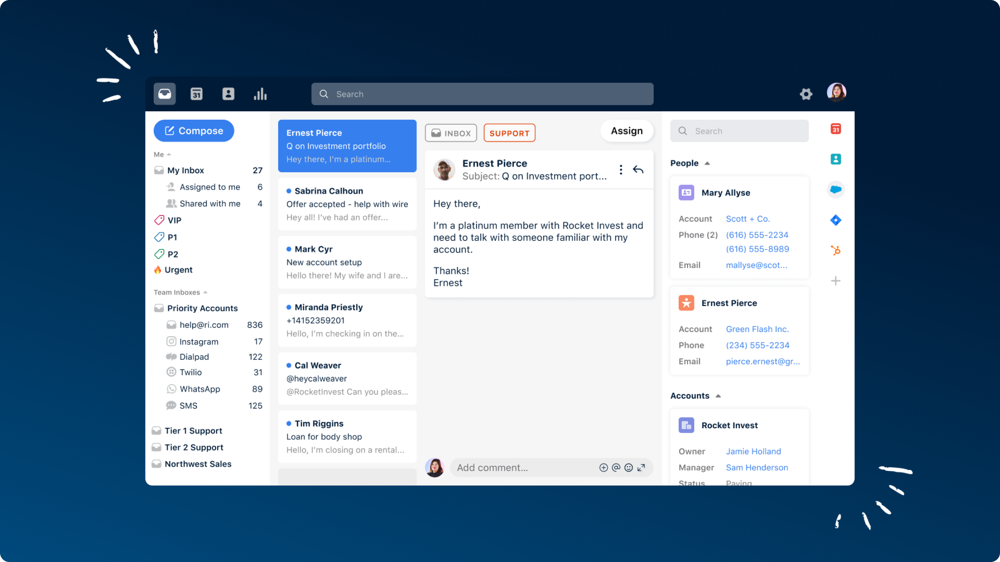

<div align="left">

[](https://front.com)

# [Front](https://front.com)

Front is a customer operations platform that enables support, sales, and account management teams to deliver exceptional service at scale. Front streamlines customer communication by combining the efficiency of a help desk and the familiarity of email, with automated workflows and real-time collaboration behind the scenes.

With Front, teams can centralize messages across channels, route them to the right person, and unlock visibility and insights across all of their customer operations. More than 8000 businesses use Front to drive operational efficiency that prevents churn, improves retention, and propels customer growth.

</div>

## Requirements

Building the API client library requires:

1. Java 1.8+
2. Maven (3.8.3+)/Gradle (7.2+)

If you are adding this library to an Android Application or Library:

3. Android 8.0+ (API Level 26+)

## Installation<a id="installation"></a>
<div align="center">
  <a href="https://konfigthis.com/sdk-sign-up?company=Front&serviceName=Core&language=Java">
    
  </a>
</div>

### Maven users

Add this dependency to your project's POM:

```xml
<dependency>
  <groupId>com.konfigthis</groupId>
  <artifactId>front-core-java-sdk</artifactId>
  <version>1.0.0</version>
  <scope>compile</scope>
</dependency>
```

### Gradle users

Add this dependency to your `build.gradle`:

```groovy
// build.gradle
repositories {
  mavenCentral()
}

dependencies {
   implementation "com.konfigthis:front-core-java-sdk:1.0.0"
}
```

### Android users

Make sure your `build.gradle` file as a `minSdk` version of at least 26:
```groovy
// build.gradle
android {
    defaultConfig {
        minSdk 26
    }
}
```

Also make sure your library or application has internet permissions in your `AndroidManifest.xml`:

```xml
<!--AndroidManifest.xml-->
<?xml version="1.0" encoding="utf-8"?>
<manifest xmlns:android="http://schemas.android.com/apk/res/android"
    xmlns:tools="http://schemas.android.com/tools">
    <uses-permission android:name="android.permission.INTERNET"/>
</manifest>
```

### Others

At first generate the JAR by executing:

```shell
mvn clean package
```

Then manually install the following JARs:

* `target/front-core-java-sdk-1.0.0.jar`
* `target/lib/*.jar`

## Getting Started

Please follow the [installation](#installation) instruction and execute the following Java code:

```java
import com.konfigthis.client.ApiClient;
import com.konfigthis.client.ApiException;
import com.konfigthis.client.ApiResponse;
import com.konfigthis.client.FrontCore;
import com.konfigthis.client.Configuration;
import com.konfigthis.client.auth.*;
import com.konfigthis.client.model.*;
import com.konfigthis.client.api.AccountsApi;
import java.util.List;
import java.util.Map;
import java.util.UUID;

public class Example {
  public static void main(String[] args) {
    Configuration configuration = new Configuration();
    configuration.host = "https://api2.frontapp.com";
    
    // Configure HTTP bearer authorization: http
    configuration.token = "BEARER TOKEN";
    FrontCore client = new FrontCore(configuration);
    List<String> contactIds = Arrays.asList(); // The contact IDs to include. Alternatively, you can supply the contact source and handle as a [resource alias](https://dev.frontapp.com/docs/resource-aliases-1).
    String accountId = "acc_123"; // The Account ID. Alternatively, you can supply the account domain or external ID as a [resource alias](https://dev.frontapp.com/docs/resource-aliases-1).
    try {
      client
              .accounts
              .addContactsToAccount(contactIds, accountId)
              .execute();
    } catch (ApiException e) {
      System.err.println("Exception when calling AccountsApi#addContactsToAccount");
      System.err.println("Status code: " + e.getStatusCode());
      System.err.println("Reason: " + e.getResponseBody());
      System.err.println("Response headers: " + e.getResponseHeaders());
      e.printStackTrace();
    }

    // Use .executeWithHttpInfo() to retrieve HTTP Status Code, Headers and Request
    try {
      client
              .accounts
              .addContactsToAccount(contactIds, accountId)
              .executeWithHttpInfo();
    } catch (ApiException e) {
      System.err.println("Exception when calling AccountsApi#addContactsToAccount");
      System.err.println("Status code: " + e.getStatusCode());
      System.err.println("Reason: " + e.getResponseBody());
      System.err.println("Response headers: " + e.getResponseHeaders());
      e.printStackTrace();
    }
  }
}

```

## Documentation for API Endpoints

All URIs are relative to *https://api2.frontapp.com*

Class | Method | HTTP request | Description
------------ | ------------- | ------------- | -------------
*AccountsApi* | [**addContactsToAccount**](docs/AccountsApi.md#addContactsToAccount) | **POST** /accounts/{account_id}/contacts | Add contact to Account
*AccountsApi* | [**createNewAccount**](docs/AccountsApi.md#createNewAccount) | **POST** /accounts | Create account
*AccountsApi* | [**deleteAccount**](docs/AccountsApi.md#deleteAccount) | **DELETE** /accounts/{account_id} | Delete an account
*AccountsApi* | [**getAccount**](docs/AccountsApi.md#getAccount) | **GET** /accounts/{account_id} | Fetch an account
*AccountsApi* | [**listAccountContacts**](docs/AccountsApi.md#listAccountContacts) | **GET** /accounts/{account_id}/contacts | List account contacts
*AccountsApi* | [**listCompanyAccounts**](docs/AccountsApi.md#listCompanyAccounts) | **GET** /accounts | List Accounts
*AccountsApi* | [**removeContactFrom**](docs/AccountsApi.md#removeContactFrom) | **DELETE** /accounts/{account_id}/contacts | Remove contact from Account
*AccountsApi* | [**updateAccount**](docs/AccountsApi.md#updateAccount) | **PATCH** /accounts/{account_id} | Update account
*AnalyticsApi* | [**createNewExport**](docs/AnalyticsApi.md#createNewExport) | **POST** /analytics/exports | Create a new analytics export.
*AnalyticsApi* | [**createNewReport**](docs/AnalyticsApi.md#createNewReport) | **POST** /analytics/reports | Create a new analytics report.
*AnalyticsApi* | [**getExport**](docs/AnalyticsApi.md#getExport) | **GET** /analytics/exports/{export_id} | Fetch an analytics export.
*AnalyticsApi* | [**getReport**](docs/AnalyticsApi.md#getReport) | **GET** /analytics/reports/{report_uid} | Fetch an analytics report.
*AttachmentsApi* | [**downloadAttachmentFile**](docs/AttachmentsApi.md#downloadAttachmentFile) | **GET** /download/{attachment_link_id} | Download attachment
*ChannelsApi* | [**createInboxChannel**](docs/ChannelsApi.md#createInboxChannel) | **POST** /inboxes/{inbox_id}/channels | Create a channel
*ChannelsApi* | [**getChannel**](docs/ChannelsApi.md#getChannel) | **GET** /channels/{channel_id} | Get channel
*ChannelsApi* | [**list**](docs/ChannelsApi.md#list) | **GET** /channels | List channels
*ChannelsApi* | [**listTeam**](docs/ChannelsApi.md#listTeam) | **GET** /teams/{team_id}/channels | List team channels
*ChannelsApi* | [**listTeammate**](docs/ChannelsApi.md#listTeammate) | **GET** /teammates/{teammate_id}/channels | List teammate channels
*ChannelsApi* | [**updateChannel**](docs/ChannelsApi.md#updateChannel) | **PATCH** /channels/{channel_id} | Update Channel
*ChannelsApi* | [**validateSMTPSettings**](docs/ChannelsApi.md#validateSMTPSettings) | **POST** /channels/{channel_id}/validate | Validate channel
*CommentsApi* | [**addNewComment**](docs/CommentsApi.md#addNewComment) | **POST** /conversations/{conversation_id}/comments | Add comment
*CommentsApi* | [**getComment**](docs/CommentsApi.md#getComment) | **GET** /comments/{comment_id} | Get comment
*CommentsApi* | [**listConversationComments**](docs/CommentsApi.md#listConversationComments) | **GET** /conversations/{conversation_id}/comments | List conversation comments
*CommentsApi* | [**listMentionedTeammates**](docs/CommentsApi.md#listMentionedTeammates) | **GET** /comments/{comment_id}/mentions | List comment mentions
*ContactGroupsApi* | [**addContactsToGroup**](docs/ContactGroupsApi.md#addContactsToGroup) | **POST** /contact_groups/{contact_group_id}/contacts | Add contacts to group
*ContactGroupsApi* | [**createNewGroup**](docs/ContactGroupsApi.md#createNewGroup) | **POST** /contact_groups | Create group
*ContactGroupsApi* | [**createNewGroup_0**](docs/ContactGroupsApi.md#createNewGroup_0) | **POST** /teams/{team_id}/contact_groups | Create team group
*ContactGroupsApi* | [**createTeammateGroup**](docs/ContactGroupsApi.md#createTeammateGroup) | **POST** /teammates/{teammate_id}/contact_groups | Create teammate group
*ContactGroupsApi* | [**deleteGroup**](docs/ContactGroupsApi.md#deleteGroup) | **DELETE** /contact_groups/{contact_group_id} | Delete group
*ContactGroupsApi* | [**listGroupContacts**](docs/ContactGroupsApi.md#listGroupContacts) | **GET** /contact_groups/{contact_group_id}/contacts | List contacts in group
*ContactGroupsApi* | [**listGroups**](docs/ContactGroupsApi.md#listGroups) | **GET** /contact_groups | List groups
*ContactGroupsApi* | [**listTeamGroups**](docs/ContactGroupsApi.md#listTeamGroups) | **GET** /teams/{team_id}/contact_groups | List team groups
*ContactGroupsApi* | [**listTeammateGroups**](docs/ContactGroupsApi.md#listTeammateGroups) | **GET** /teammates/{teammate_id}/contact_groups | List teammate groups
*ContactGroupsApi* | [**removeContacts**](docs/ContactGroupsApi.md#removeContacts) | **DELETE** /contact_groups/{contact_group_id}/contacts | Remove contacts from group
*ContactHandlesApi* | [**addNewHandle**](docs/ContactHandlesApi.md#addNewHandle) | **POST** /contacts/{contact_id}/handles | Add contact handle
*ContactHandlesApi* | [**removeHandle**](docs/ContactHandlesApi.md#removeHandle) | **DELETE** /contacts/{contact_id}/handles | Delete contact handle
*ContactNotesApi* | [**createNewNote**](docs/ContactNotesApi.md#createNewNote) | **POST** /contacts/{contact_id}/notes | Add note
*ContactNotesApi* | [**list**](docs/ContactNotesApi.md#list) | **GET** /contacts/{contact_id}/notes | List notes
*ContactsApi* | [**createNewContact**](docs/ContactsApi.md#createNewContact) | **POST** /contacts | Create contact
*ContactsApi* | [**createTeamContact**](docs/ContactsApi.md#createTeamContact) | **POST** /teams/{team_id}/contacts | Create team contact
*ContactsApi* | [**createTeammateContact**](docs/ContactsApi.md#createTeammateContact) | **POST** /teammates/{teammate_id}/contacts | Create teammate contact
*ContactsApi* | [**deleteContact**](docs/ContactsApi.md#deleteContact) | **DELETE** /contacts/{contact_id} | Delete a contact
*ContactsApi* | [**getOneContact**](docs/ContactsApi.md#getOneContact) | **GET** /contacts/{contact_id} | Get contact
*ContactsApi* | [**listCompanyContacts**](docs/ContactsApi.md#listCompanyContacts) | **GET** /contacts | List contacts
*ContactsApi* | [**listConversationsReverseChronologicalOrder**](docs/ContactsApi.md#listConversationsReverseChronologicalOrder) | **GET** /contacts/{contact_id}/conversations | List contact conversations
*ContactsApi* | [**listTeamContacts**](docs/ContactsApi.md#listTeamContacts) | **GET** /teams/{team_id}/contacts | List team contacts
*ContactsApi* | [**listTeammateContacts**](docs/ContactsApi.md#listTeammateContacts) | **GET** /teammates/{teammate_id}/contacts | List teammate contacts
*ContactsApi* | [**mergeContacts**](docs/ContactsApi.md#mergeContacts) | **POST** /contacts/merge | Merge contacts
*ContactsApi* | [**updateContact**](docs/ContactsApi.md#updateContact) | **PATCH** /contacts/{contact_id} | Update a contact
*ConversationsApi* | [**addFollowers**](docs/ConversationsApi.md#addFollowers) | **POST** /conversations/{conversation_id}/followers | Add conversation followers
*ConversationsApi* | [**addLink**](docs/ConversationsApi.md#addLink) | **POST** /conversations/{conversation_id}/links | Add conversation link
*ConversationsApi* | [**addTagsToConversation**](docs/ConversationsApi.md#addTagsToConversation) | **POST** /conversations/{conversation_id}/tags | Add conversation tag
*ConversationsApi* | [**createDiscussion**](docs/ConversationsApi.md#createDiscussion) | **POST** /conversations | Create discussion conversation
*ConversationsApi* | [**getById**](docs/ConversationsApi.md#getById) | **GET** /conversations/{conversation_id} | Get conversation
*ConversationsApi* | [**listEvents**](docs/ConversationsApi.md#listEvents) | **GET** /conversations/{conversation_id}/events | List conversation events
*ConversationsApi* | [**listFollowers**](docs/ConversationsApi.md#listFollowers) | **GET** /conversations/{conversation_id}/followers | List conversation followers
*ConversationsApi* | [**listInReverseChronologicalOrder**](docs/ConversationsApi.md#listInReverseChronologicalOrder) | **GET** /conversations | List conversations
*ConversationsApi* | [**listInboxes**](docs/ConversationsApi.md#listInboxes) | **GET** /conversations/{conversation_id}/inboxes | List conversation inboxes
*ConversationsApi* | [**listMessagesInReverseChronologicalOrder**](docs/ConversationsApi.md#listMessagesInReverseChronologicalOrder) | **GET** /conversations/{conversation_id}/messages | List conversation messages
*ConversationsApi* | [**removeFollowers**](docs/ConversationsApi.md#removeFollowers) | **DELETE** /conversations/{conversation_id}/followers | Delete conversation followers
*ConversationsApi* | [**removeLinks**](docs/ConversationsApi.md#removeLinks) | **DELETE** /conversations/{conversation_id}/links | Remove conversation links
*ConversationsApi* | [**removeTag**](docs/ConversationsApi.md#removeTag) | **DELETE** /conversations/{conversation_id}/tags | Remove conversation tag
*ConversationsApi* | [**searchByQuery**](docs/ConversationsApi.md#searchByQuery) | **GET** /conversations/search/{query} | Search conversations
*ConversationsApi* | [**updateAssignee**](docs/ConversationsApi.md#updateAssignee) | **PUT** /conversations/{conversation_id}/assignee | Update conversation assignee
*ConversationsApi* | [**updateConversationById**](docs/ConversationsApi.md#updateConversationById) | **PATCH** /conversations/{conversation_id} | Update conversation
*ConversationsApi* | [**updateReminders**](docs/ConversationsApi.md#updateReminders) | **PATCH** /conversations/{conversation_id}/reminders | Update conversation reminders
*CustomFieldsApi* | [**getList**](docs/CustomFieldsApi.md#getList) | **GET** /links/custom_fields | List Link&#39;s custom fields
*CustomFieldsApi* | [**listAccountCustomFields**](docs/CustomFieldsApi.md#listAccountCustomFields) | **GET** /accounts/custom_fields | List Account&#39;s custom fields
*CustomFieldsApi* | [**listContactCustomFields**](docs/CustomFieldsApi.md#listContactCustomFields) | **GET** /custom_fields | List Contact&#39;s custom fields
*CustomFieldsApi* | [**listContactFields**](docs/CustomFieldsApi.md#listContactFields) | **GET** /contacts/custom_fields | List Contact&#39;s custom fields
*CustomFieldsApi* | [**listConversationCustomFields**](docs/CustomFieldsApi.md#listConversationCustomFields) | **GET** /conversations/custom_fields | List Conversation&#39;s custom fields
*CustomFieldsApi* | [**listInboxCustomFields**](docs/CustomFieldsApi.md#listInboxCustomFields) | **GET** /inboxes/custom_fields | List Inbox&#39;s custom fields
*CustomFieldsApi* | [**listTeammateCustomFields**](docs/CustomFieldsApi.md#listTeammateCustomFields) | **GET** /teammates/custom_fields | List Teammate&#39;s custom fields
*DraftsApi* | [**createDraftReply**](docs/DraftsApi.md#createDraftReply) | **POST** /conversations/{conversation_id}/drafts | Create draft reply
*DraftsApi* | [**createNewDraftMessage**](docs/DraftsApi.md#createNewDraftMessage) | **POST** /channels/{channel_id}/drafts | Create draft
*DraftsApi* | [**deleteDraftMessage**](docs/DraftsApi.md#deleteDraftMessage) | **DELETE** /drafts/{draft_id} | Delete draft
*DraftsApi* | [**editMessage**](docs/DraftsApi.md#editMessage) | **PATCH** /drafts/{message_id} | Edit draft
*DraftsApi* | [**listConversationDrafts**](docs/DraftsApi.md#listConversationDrafts) | **GET** /conversations/{conversation_id}/drafts | List conversation drafts
*EventsApi* | [**getEvent**](docs/EventsApi.md#getEvent) | **GET** /events/{event_id} | Get event
*EventsApi* | [**listDetailedInboxEvents**](docs/EventsApi.md#listDetailedInboxEvents) | **GET** /events | List events
*InboxesApi* | [**addTeammateAccess**](docs/InboxesApi.md#addTeammateAccess) | **POST** /inboxes/{inbox_id}/teammates | Add inbox access
*InboxesApi* | [**createDefaultTeamInbox**](docs/InboxesApi.md#createDefaultTeamInbox) | **POST** /inboxes | Create inbox
*InboxesApi* | [**createTeamInbox**](docs/InboxesApi.md#createTeamInbox) | **POST** /teams/{team_id}/inboxes | Create team inbox
*InboxesApi* | [**getInbox**](docs/InboxesApi.md#getInbox) | **GET** /inboxes/{inbox_id} | Get inbox
*InboxesApi* | [**listChannels**](docs/InboxesApi.md#listChannels) | **GET** /inboxes/{inbox_id}/channels | List inbox channels
*InboxesApi* | [**listConversationsInbox**](docs/InboxesApi.md#listConversationsInbox) | **GET** /inboxes/{inbox_id}/conversations | List inbox conversations
*InboxesApi* | [**listInboxes**](docs/InboxesApi.md#listInboxes) | **GET** /inboxes | List inboxes
*InboxesApi* | [**listTeamInboxes**](docs/InboxesApi.md#listTeamInboxes) | **GET** /teams/{team_id}/inboxes | List team inboxes
*InboxesApi* | [**listTeammatesAccess**](docs/InboxesApi.md#listTeammatesAccess) | **GET** /inboxes/{inbox_id}/teammates | List inbox access
*InboxesApi* | [**removeAccess**](docs/InboxesApi.md#removeAccess) | **DELETE** /inboxes/{inbox_id}/teammates | Removes inbox access
*KnowledgeBasesApi* | [**createArticleDefaultLocale**](docs/KnowledgeBasesApi.md#createArticleDefaultLocale) | **POST** /knowledge_bases/{knowledge_base_id}/articles | Create article in a knowledge base in default locale
*KnowledgeBasesApi* | [**createArticleLocale**](docs/KnowledgeBasesApi.md#createArticleLocale) | **POST** /knowledge_bases/{knowledge_base_id}/locales/{locale}/articles | Create article in a knowledge base in specified locale
*KnowledgeBasesApi* | [**createCategoryDefaultLocale**](docs/KnowledgeBasesApi.md#createCategoryDefaultLocale) | **POST** /knowledge_bases/{knowledge_base_id}/categories | Create knowledge base category in default locale
*KnowledgeBasesApi* | [**createCategoryInLocale**](docs/KnowledgeBasesApi.md#createCategoryInLocale) | **POST** /knowledge_bases/{knowledge_base_id}/locales/{locale}/categories | Create knowledge base category in specified locale
*KnowledgeBasesApi* | [**createNewKnowledgeBase**](docs/KnowledgeBasesApi.md#createNewKnowledgeBase) | **POST** /knowledge_bases | Create a knowledge base
*KnowledgeBasesApi* | [**deleteArticle**](docs/KnowledgeBasesApi.md#deleteArticle) | **DELETE** /knowledge_base_articles/{article_id} | Delete an article
*KnowledgeBasesApi* | [**deleteCategory**](docs/KnowledgeBasesApi.md#deleteCategory) | **DELETE** /knowledge_base_categories/{category_id} | Delete a knowledge base category
*KnowledgeBasesApi* | [**downloadAttachmentArticle**](docs/KnowledgeBasesApi.md#downloadAttachmentArticle) | **GET** /knowledge_base_articles/{article_id}/download/{attachment_id} | Download attachment from an article
*KnowledgeBasesApi* | [**getArticleById**](docs/KnowledgeBasesApi.md#getArticleById) | **GET** /knowledge_base_articles/{article_id} | Get a knowledge base article
*KnowledgeBasesApi* | [**getArticleContent**](docs/KnowledgeBasesApi.md#getArticleContent) | **GET** /knowledge_base_articles/{article_id}/locales/{locale}/content | Get knowledge base article with content in specified locale
*KnowledgeBasesApi* | [**getCategory**](docs/KnowledgeBasesApi.md#getCategory) | **GET** /knowledge_base_categories/{category_id} | Get a knowledge base category
*KnowledgeBasesApi* | [**getCategoryContentDefaultLocale**](docs/KnowledgeBasesApi.md#getCategoryContentDefaultLocale) | **GET** /knowledge_base_categories/{category_id}/content | Get knowledge base category content in default locale
*KnowledgeBasesApi* | [**getCategoryContentLocale**](docs/KnowledgeBasesApi.md#getCategoryContentLocale) | **GET** /knowledge_base_categories/{category_id}/locales/{locale}/content | Get knowledge base category with content in specified locale
*KnowledgeBasesApi* | [**getContentDefaultLocale**](docs/KnowledgeBasesApi.md#getContentDefaultLocale) | **GET** /knowledge_base_articles/{article_id}/content | Get knowledge base article with content in default locale
*KnowledgeBasesApi* | [**getContentDefaultLocale_0**](docs/KnowledgeBasesApi.md#getContentDefaultLocale_0) | **GET** /knowledge_bases/{knowledge_base_id}/content | Get a knowledge base with content in default locale
*KnowledgeBasesApi* | [**getKnowledgeBase**](docs/KnowledgeBasesApi.md#getKnowledgeBase) | **GET** /knowledge_bases/{knowledge_base_id} | Get a knowledge base
*KnowledgeBasesApi* | [**getKnowledgeBaseContentInLocale**](docs/KnowledgeBasesApi.md#getKnowledgeBaseContentInLocale) | **GET** /knowledge_bases/{knowledge_base_id}/locales/{locale}/content | Get a knowledge base with content in specified locale
*KnowledgeBasesApi* | [**listArticlesInBase**](docs/KnowledgeBasesApi.md#listArticlesInBase) | **GET** /knowledge_bases/{knowledge_base_id}/articles | List articles in a knowledge base
*KnowledgeBasesApi* | [**listArticlesInCategory**](docs/KnowledgeBasesApi.md#listArticlesInCategory) | **GET** /knowledge_base_categories/{category_id}/articles | List articles in a category
*KnowledgeBasesApi* | [**listCategoriesInBase**](docs/KnowledgeBasesApi.md#listCategoriesInBase) | **GET** /knowledge_bases/{knowledge_base_id}/categories | List categories in a knowledge base
*KnowledgeBasesApi* | [**listKnowledgeBases**](docs/KnowledgeBasesApi.md#listKnowledgeBases) | **GET** /knowledge_bases | List knowledge bases
*KnowledgeBasesApi* | [**updateArticleContentDefaultLocale**](docs/KnowledgeBasesApi.md#updateArticleContentDefaultLocale) | **PATCH** /knowledge_base_articles/{article_id}/content | Update article content in default locale.
*KnowledgeBasesApi* | [**updateArticleContentLocale**](docs/KnowledgeBasesApi.md#updateArticleContentLocale) | **PATCH** /knowledge_base_articles/{article_id}/locales/{locale}/content | Update article content in specified locale
*KnowledgeBasesApi* | [**updateCategoryContentLocale**](docs/KnowledgeBasesApi.md#updateCategoryContentLocale) | **PATCH** /knowledge_base_categories/{category_id}/locales/{locale}/content | Update knowledge base category in specified locale
*KnowledgeBasesApi* | [**updateCategoryDefaultLocale**](docs/KnowledgeBasesApi.md#updateCategoryDefaultLocale) | **PATCH** /knowledge_base_categories/{category_id}/content | Update knowledge base category in default locale
*KnowledgeBasesApi* | [**updateDefaultKnowledgeBase**](docs/KnowledgeBasesApi.md#updateDefaultKnowledgeBase) | **PATCH** /knowledge_bases/{knowledge_base_id}/content | Update knowledge base in default locale
*KnowledgeBasesApi* | [**updateKnowledgeBaseLocale**](docs/KnowledgeBasesApi.md#updateKnowledgeBaseLocale) | **PATCH** /knowledge_bases/{knowledge_base_id}/locales/{locale}/content | Update knowledge base in specified locale
*LinksApi* | [**createLink**](docs/LinksApi.md#createLink) | **POST** /links | Create link
*LinksApi* | [**getLink**](docs/LinksApi.md#getLink) | **GET** /links/{link_id} | Get link
*LinksApi* | [**listByIdAndType**](docs/LinksApi.md#listByIdAndType) | **GET** /links | List links
*LinksApi* | [**listConversations**](docs/LinksApi.md#listConversations) | **GET** /links/{link_id}/conversations | List link conversations
*LinksApi* | [**updateLink**](docs/LinksApi.md#updateLink) | **PATCH** /links/{link_id} | Update a link
*MessageTemplateFoldersApi* | [**createChildFolder**](docs/MessageTemplateFoldersApi.md#createChildFolder) | **POST** /message_template_folders/{message_template_folder_id}/message_template_folders | Create child folder
*MessageTemplateFoldersApi* | [**createNewFolder**](docs/MessageTemplateFoldersApi.md#createNewFolder) | **POST** /message_template_folders | Create folder
*MessageTemplateFoldersApi* | [**createNewFolder_0**](docs/MessageTemplateFoldersApi.md#createNewFolder_0) | **POST** /teammates/{teammate_id}/message_template_folders | Create teammate folder
*MessageTemplateFoldersApi* | [**createNewFolder_1**](docs/MessageTemplateFoldersApi.md#createNewFolder_1) | **POST** /teams/{team_id}/message_template_folders | Create team folder
*MessageTemplateFoldersApi* | [**deleteFolder**](docs/MessageTemplateFoldersApi.md#deleteFolder) | **DELETE** /message_template_folders/{message_template_folder_id} | Delete folder
*MessageTemplateFoldersApi* | [**getChildFolders**](docs/MessageTemplateFoldersApi.md#getChildFolders) | **GET** /message_template_folders/{message_template_folder_id}/message_template_folders | Get child folders
*MessageTemplateFoldersApi* | [**getFolder**](docs/MessageTemplateFoldersApi.md#getFolder) | **GET** /message_template_folders/{message_template_folder_id} | Get folder
*MessageTemplateFoldersApi* | [**listFolders**](docs/MessageTemplateFoldersApi.md#listFolders) | **GET** /message_template_folders | List folders
*MessageTemplateFoldersApi* | [**listTeamFolders**](docs/MessageTemplateFoldersApi.md#listTeamFolders) | **GET** /teams/{team_id}/message_template_folders | List team folders
*MessageTemplateFoldersApi* | [**listTeammateFolders**](docs/MessageTemplateFoldersApi.md#listTeammateFolders) | **GET** /teammates/{teammate_id}/message_template_folders | List teammate folders
*MessageTemplateFoldersApi* | [**updateFolder**](docs/MessageTemplateFoldersApi.md#updateFolder) | **PATCH** /message_template_folders/{message_template_folder_id} | Update folder
*MessageTemplatesApi* | [**addNewTeammateTemplate**](docs/MessageTemplatesApi.md#addNewTeammateTemplate) | **POST** /teammates/{teammate_id}/message_templates | Create teammate message template
*MessageTemplatesApi* | [**createChildTemplate**](docs/MessageTemplatesApi.md#createChildTemplate) | **POST** /message_template_folders/{message_template_folder_id}/message_templates | Create child template
*MessageTemplatesApi* | [**createNewTemplate**](docs/MessageTemplatesApi.md#createNewTemplate) | **POST** /message_templates | Create message template
*MessageTemplatesApi* | [**createTeamTemplate**](docs/MessageTemplatesApi.md#createTeamTemplate) | **POST** /teams/{team_id}/message_templates | Create team message template
*MessageTemplatesApi* | [**deleteTemplate**](docs/MessageTemplatesApi.md#deleteTemplate) | **DELETE** /message_templates/{message_template_id} | Delete message template
*MessageTemplatesApi* | [**getChildTemplates**](docs/MessageTemplatesApi.md#getChildTemplates) | **GET** /message_template_folders/{message_template_folder_id}/message_templates | Get child templates
*MessageTemplatesApi* | [**getTemplateById**](docs/MessageTemplatesApi.md#getTemplateById) | **GET** /message_templates/{message_template_id} | Get message template
*MessageTemplatesApi* | [**list**](docs/MessageTemplatesApi.md#list) | **GET** /message_templates | List message templates
*MessageTemplatesApi* | [**listTeamTemplates**](docs/MessageTemplatesApi.md#listTeamTemplates) | **GET** /teams/{team_id}/message_templates | List team message templates
*MessageTemplatesApi* | [**listTeammateTemplates**](docs/MessageTemplatesApi.md#listTeammateTemplates) | **GET** /teammates/{teammate_id}/message_templates | List teammate message templates
*MessageTemplatesApi* | [**updateTemplateById**](docs/MessageTemplatesApi.md#updateTemplateById) | **PATCH** /message_templates/{message_template_id} | Update message template
*MessagesApi* | [**createMessageReply**](docs/MessagesApi.md#createMessageReply) | **POST** /conversations/{conversation_id}/messages | Create message reply
*MessagesApi* | [**createNewMessage**](docs/MessagesApi.md#createNewMessage) | **POST** /channels/{channel_id}/messages | Create message
*MessagesApi* | [**getMessageById**](docs/MessagesApi.md#getMessageById) | **GET** /messages/{message_id} | Get message
*MessagesApi* | [**getMessageSeenStatus**](docs/MessagesApi.md#getMessageSeenStatus) | **GET** /messages/{message_id}/seen | Get message seen status
*MessagesApi* | [**importNewInboxMessage**](docs/MessagesApi.md#importNewInboxMessage) | **POST** /inboxes/{inbox_id}/imported_messages | Import message
*MessagesApi* | [**markMessageSeen**](docs/MessagesApi.md#markMessageSeen) | **POST** /messages/{message_id}/seen | Mark message seen
*MessagesApi* | [**receiveCustomMessage**](docs/MessagesApi.md#receiveCustomMessage) | **POST** /channels/{channel_id}/incoming_messages | Receive custom messages
*RulesApi* | [**getRule**](docs/RulesApi.md#getRule) | **GET** /rules/{rule_id} | Get rule
*RulesApi* | [**listAllCompanyRules**](docs/RulesApi.md#listAllCompanyRules) | **GET** /company/rules | List all company rules
*RulesApi* | [**listCompanyRules**](docs/RulesApi.md#listCompanyRules) | **GET** /rules | List rules
*RulesApi* | [**listTeamRules**](docs/RulesApi.md#listTeamRules) | **GET** /teams/{team_id}/rules | List team rules
*RulesApi* | [**listTeammateRules**](docs/RulesApi.md#listTeammateRules) | **GET** /teammates/{teammate_id}/rules | List teammate rules
*ShiftsApi* | [**addTeammatesToShift**](docs/ShiftsApi.md#addTeammatesToShift) | **POST** /shift/{shift_id}/teammates | Add teammates to shift
*ShiftsApi* | [**createShift**](docs/ShiftsApi.md#createShift) | **POST** /shifts | Create shift
*ShiftsApi* | [**createTeamShift**](docs/ShiftsApi.md#createTeamShift) | **POST** /teams/{team_id}/shifts | Create team shift
*ShiftsApi* | [**getShift**](docs/ShiftsApi.md#getShift) | **GET** /shift/{shift_id} | Get shift
*ShiftsApi* | [**listShiftTeammates**](docs/ShiftsApi.md#listShiftTeammates) | **GET** /shift/{shift_id}/teammates | List shift&#39;s teammates
*ShiftsApi* | [**listShifts**](docs/ShiftsApi.md#listShifts) | **GET** /shifts | List Shifts
*ShiftsApi* | [**listTeamShifts**](docs/ShiftsApi.md#listTeamShifts) | **GET** /teams/{team_id}/shifts | List team Shifts
*ShiftsApi* | [**removeTeammatesFromShift**](docs/ShiftsApi.md#removeTeammatesFromShift) | **DELETE** /shift/{shift_id}/teammates | Remove teammates from shift
*ShiftsApi* | [**teammateShiftsList**](docs/ShiftsApi.md#teammateShiftsList) | **GET** /teammates/{teammate_id}/shifts | List Teammate Shifts
*ShiftsApi* | [**updateShift**](docs/ShiftsApi.md#updateShift) | **PATCH** /shifts/{shift_id} | Update shift
*SignaturesApi* | [**createTeamSignature**](docs/SignaturesApi.md#createTeamSignature) | **POST** /teams/{team_id}/signatures | Create team signature
*SignaturesApi* | [**createTeammateSignature**](docs/SignaturesApi.md#createTeammateSignature) | **POST** /teammates/{teammate_id}/signatures | Create teammate signature
*SignaturesApi* | [**deleteSignature**](docs/SignaturesApi.md#deleteSignature) | **DELETE** /signatures/{signature_id} | Delete signature
*SignaturesApi* | [**getSignature**](docs/SignaturesApi.md#getSignature) | **GET** /signatures/{signature_id} | Get signatures
*SignaturesApi* | [**listTeam**](docs/SignaturesApi.md#listTeam) | **GET** /teams/{team_id}/signatures | List team signatures
*SignaturesApi* | [**listTeammate**](docs/SignaturesApi.md#listTeammate) | **GET** /teammates/{teammate_id}/signatures | List teammate signatures
*SignaturesApi* | [**updateSignature**](docs/SignaturesApi.md#updateSignature) | **PATCH** /signatures/{signature_id} | Update signature
*TagsApi* | [**createChildTag**](docs/TagsApi.md#createChildTag) | **POST** /tags/{tag_id}/children | Create child tag
*TagsApi* | [**createCompanyTag**](docs/TagsApi.md#createCompanyTag) | **POST** /company/tags | Create company tag
*TagsApi* | [**createTagOldestTeam**](docs/TagsApi.md#createTagOldestTeam) | **POST** /tags | Create tag
*TagsApi* | [**createTeamTag**](docs/TagsApi.md#createTeamTag) | **POST** /teams/{team_id}/tags | Create team tag
*TagsApi* | [**createTeammateTag**](docs/TagsApi.md#createTeammateTag) | **POST** /teammates/{teammate_id}/tags | Create teammate tag
*TagsApi* | [**deleteTag**](docs/TagsApi.md#deleteTag) | **DELETE** /tags/{tag_id} | Delete tag
*TagsApi* | [**getTag**](docs/TagsApi.md#getTag) | **GET** /tags/{tag_id} | Get tag
*TagsApi* | [**listAll**](docs/TagsApi.md#listAll) | **GET** /tags | List tags
*TagsApi* | [**listChildren**](docs/TagsApi.md#listChildren) | **GET** /tags/{tag_id}/children | List tag children
*TagsApi* | [**listCompany**](docs/TagsApi.md#listCompany) | **GET** /company/tags | List company tags
*TagsApi* | [**listTaggedConversations**](docs/TagsApi.md#listTaggedConversations) | **GET** /tags/{tag_id}/conversations | List tagged conversations
*TagsApi* | [**listTeamTags**](docs/TagsApi.md#listTeamTags) | **GET** /teams/{team_id}/tags | List team tags
*TagsApi* | [**listTeammateTags**](docs/TagsApi.md#listTeammateTags) | **GET** /teammates/{teammate_id}/tags | List teammate tags
*TagsApi* | [**updateTag**](docs/TagsApi.md#updateTag) | **PATCH** /tags/{tag_id} | Update a tag
*TeammatesApi* | [**getInboxList**](docs/TeammatesApi.md#getInboxList) | **GET** /teammates/{teammate_id}/inboxes | List teammate inboxes
*TeammatesApi* | [**getTeammateById**](docs/TeammatesApi.md#getTeammateById) | **GET** /teammates/{teammate_id} | Get teammate
*TeammatesApi* | [**listAssignedConversations**](docs/TeammatesApi.md#listAssignedConversations) | **GET** /teammates/{teammate_id}/conversations | List assigned conversations
*TeammatesApi* | [**listCompanyMembers**](docs/TeammatesApi.md#listCompanyMembers) | **GET** /teammates | List teammates
*TeammatesApi* | [**updateTeammate**](docs/TeammatesApi.md#updateTeammate) | **PATCH** /teammates/{teammate_id} | Update teammate
*TeamsApi* | [**addTeammates**](docs/TeamsApi.md#addTeammates) | **POST** /teams/{team_id}/teammates | Add teammates to team
*TeamsApi* | [**getWorkspace**](docs/TeamsApi.md#getWorkspace) | **GET** /teams/{team_id} | Get team
*TeamsApi* | [**listTeams**](docs/TeamsApi.md#listTeams) | **GET** /teams | List teams
*TeamsApi* | [**removeTeammates**](docs/TeamsApi.md#removeTeammates) | **DELETE** /teams/{team_id}/teammates | Remove teammates from team
*TokenIdentityApi* | [**getDetails**](docs/TokenIdentityApi.md#getDetails) | **GET** /me | API Token details


## Documentation for Models

 - [Account](docs/Account.md)
 - [AccountIds](docs/AccountIds.md)
 - [AccountPatch](docs/AccountPatch.md)
 - [AccountResponse](docs/AccountResponse.md)
 - [AccountResponseLinks](docs/AccountResponseLinks.md)
 - [AccountResponseLinksRelated](docs/AccountResponseLinksRelated.md)
 - [AccountsListAccountContactsResponse](docs/AccountsListAccountContactsResponse.md)
 - [AccountsListAccountContactsResponseLinks](docs/AccountsListAccountContactsResponseLinks.md)
 - [AccountsListAccountContactsResponsePagination](docs/AccountsListAccountContactsResponsePagination.md)
 - [AccountsListCompanyAccountsResponse](docs/AccountsListCompanyAccountsResponse.md)
 - [AccountsListCompanyAccountsResponseLinks](docs/AccountsListCompanyAccountsResponseLinks.md)
 - [AccountsListCompanyAccountsResponsePagination](docs/AccountsListCompanyAccountsResponsePagination.md)
 - [AddContactsToGroup](docs/AddContactsToGroup.md)
 - [AnalyticsActivitiesColumns](docs/AnalyticsActivitiesColumns.md)
 - [AnalyticsActivitiesExportsColumns](docs/AnalyticsActivitiesExportsColumns.md)
 - [AnalyticsExportResponse](docs/AnalyticsExportResponse.md)
 - [AnalyticsExportResponseLinks](docs/AnalyticsExportResponseLinks.md)
 - [AnalyticsMessagesColumns](docs/AnalyticsMessagesColumns.md)
 - [AnalyticsMessagesExportColumns](docs/AnalyticsMessagesExportColumns.md)
 - [AnalyticsMetricId](docs/AnalyticsMetricId.md)
 - [AnalyticsReportRequest](docs/AnalyticsReportRequest.md)
 - [AnalyticsReportResponse](docs/AnalyticsReportResponse.md)
 - [AnalyticsReportResponseLinks](docs/AnalyticsReportResponseLinks.md)
 - [AnalyticsScalar](docs/AnalyticsScalar.md)
 - [AnalyticsScalarType](docs/AnalyticsScalarType.md)
 - [AnalyticsScalarValue](docs/AnalyticsScalarValue.md)
 - [Attachment](docs/Attachment.md)
 - [AttachmentMetadata](docs/AttachmentMetadata.md)
 - [ChannelIds](docs/ChannelIds.md)
 - [ChannelResponse](docs/ChannelResponse.md)
 - [ChannelResponseLinks](docs/ChannelResponseLinks.md)
 - [ChannelResponseLinksRelated](docs/ChannelResponseLinksRelated.md)
 - [ChannelResponseSettings](docs/ChannelResponseSettings.md)
 - [ChannelsListResponse](docs/ChannelsListResponse.md)
 - [ChannelsListResponseLinks](docs/ChannelsListResponseLinks.md)
 - [ChannelsValidateSmtpSettingsResponse](docs/ChannelsValidateSmtpSettingsResponse.md)
 - [CommentResponse](docs/CommentResponse.md)
 - [CommentResponseLinks](docs/CommentResponseLinks.md)
 - [CommentResponseLinksRelated](docs/CommentResponseLinksRelated.md)
 - [CommentsListConversationCommentsResponse](docs/CommentsListConversationCommentsResponse.md)
 - [CommentsListConversationCommentsResponseLinks](docs/CommentsListConversationCommentsResponseLinks.md)
 - [CommentsListMentionedTeammatesResponse](docs/CommentsListMentionedTeammatesResponse.md)
 - [CommentsListMentionedTeammatesResponseLinks](docs/CommentsListMentionedTeammatesResponseLinks.md)
 - [Contact](docs/Contact.md)
 - [ContactGroupResponses](docs/ContactGroupResponses.md)
 - [ContactGroupResponsesLinks](docs/ContactGroupResponsesLinks.md)
 - [ContactGroupResponsesLinksRelated](docs/ContactGroupResponsesLinksRelated.md)
 - [ContactGroupsListGroupsResponse](docs/ContactGroupsListGroupsResponse.md)
 - [ContactGroupsListGroupsResponseLinks](docs/ContactGroupsListGroupsResponseLinks.md)
 - [ContactHandle](docs/ContactHandle.md)
 - [ContactIds](docs/ContactIds.md)
 - [ContactNoteResponses](docs/ContactNoteResponses.md)
 - [ContactNotesListResponse](docs/ContactNotesListResponse.md)
 - [ContactNotesListResponseLinks](docs/ContactNotesListResponseLinks.md)
 - [ContactResponse](docs/ContactResponse.md)
 - [ContactResponseLinks](docs/ContactResponseLinks.md)
 - [ContactResponseLinksRelated](docs/ContactResponseLinksRelated.md)
 - [ContactsListConversationsReverseChronologicalOrderResponse](docs/ContactsListConversationsReverseChronologicalOrderResponse.md)
 - [ContactsListConversationsReverseChronologicalOrderResponseLinks](docs/ContactsListConversationsReverseChronologicalOrderResponseLinks.md)
 - [ContactsListConversationsReverseChronologicalOrderResponsePagination](docs/ContactsListConversationsReverseChronologicalOrderResponsePagination.md)
 - [ConversationResponse](docs/ConversationResponse.md)
 - [ConversationResponseLinks](docs/ConversationResponseLinks.md)
 - [ConversationResponseLinksRelated](docs/ConversationResponseLinksRelated.md)
 - [ConversationResponseMetadata](docs/ConversationResponseMetadata.md)
 - [ConversationsAddFollowersRequest](docs/ConversationsAddFollowersRequest.md)
 - [ConversationsAddLinkRequest](docs/ConversationsAddLinkRequest.md)
 - [ConversationsListEventsResponse](docs/ConversationsListEventsResponse.md)
 - [ConversationsListEventsResponseLinks](docs/ConversationsListEventsResponseLinks.md)
 - [ConversationsListEventsResponsePagination](docs/ConversationsListEventsResponsePagination.md)
 - [ConversationsListInboxesResponse](docs/ConversationsListInboxesResponse.md)
 - [ConversationsListInboxesResponseLinks](docs/ConversationsListInboxesResponseLinks.md)
 - [ConversationsRemoveFollowersRequest](docs/ConversationsRemoveFollowersRequest.md)
 - [ConversationsRemoveLinksRequest](docs/ConversationsRemoveLinksRequest.md)
 - [ConversationsSearchByQueryResponse](docs/ConversationsSearchByQueryResponse.md)
 - [ConversationsSearchByQueryResponseLinks](docs/ConversationsSearchByQueryResponseLinks.md)
 - [ConversationsSearchByQueryResponsePagination](docs/ConversationsSearchByQueryResponsePagination.md)
 - [CreateChannel](docs/CreateChannel.md)
 - [CreateChannelSettings](docs/CreateChannelSettings.md)
 - [CreateComment](docs/CreateComment.md)
 - [CreateContact](docs/CreateContact.md)
 - [CreateContactAllOf](docs/CreateContactAllOf.md)
 - [CreateContactGroup](docs/CreateContactGroup.md)
 - [CreateContactNote](docs/CreateContactNote.md)
 - [CreateConversation](docs/CreateConversation.md)
 - [CreateConversationComment](docs/CreateConversationComment.md)
 - [CreateDraft](docs/CreateDraft.md)
 - [CreateInbox](docs/CreateInbox.md)
 - [CreateLink](docs/CreateLink.md)
 - [CreateMessageTemplateAsChild](docs/CreateMessageTemplateAsChild.md)
 - [CreateMessageTemplateFolder](docs/CreateMessageTemplateFolder.md)
 - [CreateMessageTemplateFolderAsChild](docs/CreateMessageTemplateFolderAsChild.md)
 - [CreatePrivateMessageTemplate](docs/CreatePrivateMessageTemplate.md)
 - [CreatePrivateSignature](docs/CreatePrivateSignature.md)
 - [CreateSharedMessageTemplate](docs/CreateSharedMessageTemplate.md)
 - [CreateSharedSignature](docs/CreateSharedSignature.md)
 - [CreateShift](docs/CreateShift.md)
 - [CreateTag](docs/CreateTag.md)
 - [CustomFieldResponse](docs/CustomFieldResponse.md)
 - [CustomFieldResponseLinks](docs/CustomFieldResponseLinks.md)
 - [CustomFieldResponseValuesInner](docs/CustomFieldResponseValuesInner.md)
 - [CustomFieldsListAccountCustomFieldsResponse](docs/CustomFieldsListAccountCustomFieldsResponse.md)
 - [CustomFieldsListAccountCustomFieldsResponseLinks](docs/CustomFieldsListAccountCustomFieldsResponseLinks.md)
 - [CustomMessage](docs/CustomMessage.md)
 - [CustomMessageMetadata](docs/CustomMessageMetadata.md)
 - [CustomMessageSender](docs/CustomMessageSender.md)
 - [DeleteContactHandle](docs/DeleteContactHandle.md)
 - [DeleteContactHandleAllOf](docs/DeleteContactHandleAllOf.md)
 - [DeleteDraft](docs/DeleteDraft.md)
 - [DraftsListConversationDraftsResponse](docs/DraftsListConversationDraftsResponse.md)
 - [DraftsListConversationDraftsResponseLinks](docs/DraftsListConversationDraftsResponseLinks.md)
 - [DraftsListConversationDraftsResponsePagination](docs/DraftsListConversationDraftsResponsePagination.md)
 - [EditDraft](docs/EditDraft.md)
 - [EditDraftAllOf](docs/EditDraftAllOf.md)
 - [EventResponse](docs/EventResponse.md)
 - [EventResponseLinks](docs/EventResponseLinks.md)
 - [EventResponseSource](docs/EventResponseSource.md)
 - [EventResponseSourceMeta](docs/EventResponseSourceMeta.md)
 - [EventResponseTarget](docs/EventResponseTarget.md)
 - [EventResponseTargetMeta](docs/EventResponseTargetMeta.md)
 - [IdentityResponse](docs/IdentityResponse.md)
 - [IdentityResponseLinks](docs/IdentityResponseLinks.md)
 - [ImportMessage](docs/ImportMessage.md)
 - [ImportMessageMetadata](docs/ImportMessageMetadata.md)
 - [ImportMessageSender](docs/ImportMessageSender.md)
 - [InboxIds](docs/InboxIds.md)
 - [InboxResponse](docs/InboxResponse.md)
 - [InboxResponseLinks](docs/InboxResponseLinks.md)
 - [InboxResponseLinksRelated](docs/InboxResponseLinksRelated.md)
 - [KnowledgeBaseArticleCreate](docs/KnowledgeBaseArticleCreate.md)
 - [KnowledgeBaseArticlePatch](docs/KnowledgeBaseArticlePatch.md)
 - [KnowledgeBaseArticleResponse](docs/KnowledgeBaseArticleResponse.md)
 - [KnowledgeBaseArticleResponseLinks](docs/KnowledgeBaseArticleResponseLinks.md)
 - [KnowledgeBaseArticleResponseLinksRelated](docs/KnowledgeBaseArticleResponseLinksRelated.md)
 - [KnowledgeBaseArticleSlimResponse](docs/KnowledgeBaseArticleSlimResponse.md)
 - [KnowledgeBaseArticleSlimResponseLinks](docs/KnowledgeBaseArticleSlimResponseLinks.md)
 - [KnowledgeBaseArticleSlimResponseLinksRelated](docs/KnowledgeBaseArticleSlimResponseLinksRelated.md)
 - [KnowledgeBaseCategoryCreate](docs/KnowledgeBaseCategoryCreate.md)
 - [KnowledgeBaseCategoryPatch](docs/KnowledgeBaseCategoryPatch.md)
 - [KnowledgeBaseCategoryResponse](docs/KnowledgeBaseCategoryResponse.md)
 - [KnowledgeBaseCategoryResponseLinks](docs/KnowledgeBaseCategoryResponseLinks.md)
 - [KnowledgeBaseCategoryResponseLinksRelated](docs/KnowledgeBaseCategoryResponseLinksRelated.md)
 - [KnowledgeBaseCategorySlimResponse](docs/KnowledgeBaseCategorySlimResponse.md)
 - [KnowledgeBaseCategorySlimResponseLinks](docs/KnowledgeBaseCategorySlimResponseLinks.md)
 - [KnowledgeBaseCategorySlimResponseLinksRelated](docs/KnowledgeBaseCategorySlimResponseLinksRelated.md)
 - [KnowledgeBaseCreate](docs/KnowledgeBaseCreate.md)
 - [KnowledgeBasePatch](docs/KnowledgeBasePatch.md)
 - [KnowledgeBaseResponse](docs/KnowledgeBaseResponse.md)
 - [KnowledgeBaseResponseLinks](docs/KnowledgeBaseResponseLinks.md)
 - [KnowledgeBaseResponseLinksRelated](docs/KnowledgeBaseResponseLinksRelated.md)
 - [KnowledgeBaseSlimResponse](docs/KnowledgeBaseSlimResponse.md)
 - [KnowledgeBaseSlimResponseLinks](docs/KnowledgeBaseSlimResponseLinks.md)
 - [KnowledgeBaseSlimResponseLinksRelated](docs/KnowledgeBaseSlimResponseLinksRelated.md)
 - [KnowledgeBasesListArticlesInCategoryResponse](docs/KnowledgeBasesListArticlesInCategoryResponse.md)
 - [KnowledgeBasesListArticlesInCategoryResponseLinks](docs/KnowledgeBasesListArticlesInCategoryResponseLinks.md)
 - [KnowledgeBasesListArticlesInCategoryResponsePagination](docs/KnowledgeBasesListArticlesInCategoryResponsePagination.md)
 - [KnowledgeBasesListCategoriesInBaseResponse](docs/KnowledgeBasesListCategoriesInBaseResponse.md)
 - [KnowledgeBasesListCategoriesInBaseResponseLinks](docs/KnowledgeBasesListCategoriesInBaseResponseLinks.md)
 - [KnowledgeBasesListCategoriesInBaseResponsePagination](docs/KnowledgeBasesListCategoriesInBaseResponsePagination.md)
 - [KnowledgeBasesListKnowledgeBasesResponse](docs/KnowledgeBasesListKnowledgeBasesResponse.md)
 - [KnowledgeBasesListKnowledgeBasesResponseLinks](docs/KnowledgeBasesListKnowledgeBasesResponseLinks.md)
 - [LinkResponse](docs/LinkResponse.md)
 - [LinkResponseLinks](docs/LinkResponseLinks.md)
 - [LinksListByIdAndTypeResponse](docs/LinksListByIdAndTypeResponse.md)
 - [LinksListByIdAndTypeResponseLinks](docs/LinksListByIdAndTypeResponseLinks.md)
 - [LinksListByIdAndTypeResponsePagination](docs/LinksListByIdAndTypeResponsePagination.md)
 - [MergeContacts](docs/MergeContacts.md)
 - [MessageResponse](docs/MessageResponse.md)
 - [MessageResponseLinks](docs/MessageResponseLinks.md)
 - [MessageResponseLinksRelated](docs/MessageResponseLinksRelated.md)
 - [MessageResponseMetadata](docs/MessageResponseMetadata.md)
 - [MessageTemplateFolderResponse](docs/MessageTemplateFolderResponse.md)
 - [MessageTemplateFolderResponseLinks](docs/MessageTemplateFolderResponseLinks.md)
 - [MessageTemplateFolderResponseLinksRelated](docs/MessageTemplateFolderResponseLinksRelated.md)
 - [MessageTemplateFoldersDeleteFolderResponse](docs/MessageTemplateFoldersDeleteFolderResponse.md)
 - [MessageTemplateFoldersListFoldersResponse](docs/MessageTemplateFoldersListFoldersResponse.md)
 - [MessageTemplateFoldersListFoldersResponseLinks](docs/MessageTemplateFoldersListFoldersResponseLinks.md)
 - [MessageTemplateFoldersListFoldersResponsePagination](docs/MessageTemplateFoldersListFoldersResponsePagination.md)
 - [MessageTemplateResponse](docs/MessageTemplateResponse.md)
 - [MessageTemplateResponseLinks](docs/MessageTemplateResponseLinks.md)
 - [MessageTemplateResponseLinksRelated](docs/MessageTemplateResponseLinksRelated.md)
 - [MessageTemplatesListResponse](docs/MessageTemplatesListResponse.md)
 - [MessageTemplatesListResponseLinks](docs/MessageTemplatesListResponseLinks.md)
 - [MessageTemplatesListResponsePagination](docs/MessageTemplatesListResponsePagination.md)
 - [MessagesGetMessageSeenStatusResponse](docs/MessagesGetMessageSeenStatusResponse.md)
 - [MessagesGetMessageSeenStatusResponseLinks](docs/MessagesGetMessageSeenStatusResponseLinks.md)
 - [MessagesGetMessageSeenStatusResponsePagination](docs/MessagesGetMessageSeenStatusResponsePagination.md)
 - [MessagesReceiveCustomMessageResponse](docs/MessagesReceiveCustomMessageResponse.md)
 - [OutboundMessage](docs/OutboundMessage.md)
 - [OutboundMessageOptions](docs/OutboundMessageOptions.md)
 - [OutboundReplyMessage](docs/OutboundReplyMessage.md)
 - [OutboundReplyMessageOptions](docs/OutboundReplyMessageOptions.md)
 - [RecipientResponse](docs/RecipientResponse.md)
 - [RecipientResponseLinks](docs/RecipientResponseLinks.md)
 - [RecipientResponseLinksRelated](docs/RecipientResponseLinksRelated.md)
 - [Reminder](docs/Reminder.md)
 - [ReminderLinks](docs/ReminderLinks.md)
 - [ReminderLinksRelated](docs/ReminderLinksRelated.md)
 - [RemoveContactsFromGroup](docs/RemoveContactsFromGroup.md)
 - [ReplyDraft](docs/ReplyDraft.md)
 - [ReplyDraftAllOf](docs/ReplyDraftAllOf.md)
 - [RoleResponse](docs/RoleResponse.md)
 - [RoleResponseLinks](docs/RoleResponseLinks.md)
 - [RoleResponseLinksRelated](docs/RoleResponseLinksRelated.md)
 - [RuleResponse](docs/RuleResponse.md)
 - [RuleResponseLinks](docs/RuleResponseLinks.md)
 - [RuleResponseLinksRelated](docs/RuleResponseLinksRelated.md)
 - [RulesListAllCompanyRulesResponse](docs/RulesListAllCompanyRulesResponse.md)
 - [RulesListAllCompanyRulesResponseLinks](docs/RulesListAllCompanyRulesResponseLinks.md)
 - [SeenReceiptResponse](docs/SeenReceiptResponse.md)
 - [SeenReceiptResponseLinks](docs/SeenReceiptResponseLinks.md)
 - [SeenReceiptResponseLinksRelated](docs/SeenReceiptResponseLinksRelated.md)
 - [ShiftInterval](docs/ShiftInterval.md)
 - [ShiftIntervals](docs/ShiftIntervals.md)
 - [ShiftResponse](docs/ShiftResponse.md)
 - [ShiftResponseLinks](docs/ShiftResponseLinks.md)
 - [ShiftResponseLinksRelated](docs/ShiftResponseLinksRelated.md)
 - [ShiftsListShiftsResponse](docs/ShiftsListShiftsResponse.md)
 - [ShiftsListShiftsResponseLinks](docs/ShiftsListShiftsResponseLinks.md)
 - [SignatureResponse](docs/SignatureResponse.md)
 - [SignatureResponseLinks](docs/SignatureResponseLinks.md)
 - [SignatureResponseLinksRelated](docs/SignatureResponseLinksRelated.md)
 - [SignaturesListTeammateResponse](docs/SignaturesListTeammateResponse.md)
 - [SignaturesListTeammateResponseLinks](docs/SignaturesListTeammateResponseLinks.md)
 - [SignaturesListTeammateResponsePagination](docs/SignaturesListTeammateResponsePagination.md)
 - [TCIAIds](docs/TCIAIds.md)
 - [TagIds](docs/TagIds.md)
 - [TagResponse](docs/TagResponse.md)
 - [TagResponseLinks](docs/TagResponseLinks.md)
 - [TagResponseLinksRelated](docs/TagResponseLinksRelated.md)
 - [TagsListCompanyResponse](docs/TagsListCompanyResponse.md)
 - [TagsListCompanyResponseLinks](docs/TagsListCompanyResponseLinks.md)
 - [TeamIds](docs/TeamIds.md)
 - [TeamPreviewResponse](docs/TeamPreviewResponse.md)
 - [TeamPreviewResponseLinks](docs/TeamPreviewResponseLinks.md)
 - [TeamResponse](docs/TeamResponse.md)
 - [TeamResponseLinks](docs/TeamResponseLinks.md)
 - [TeammateIds](docs/TeammateIds.md)
 - [TeammateResponse](docs/TeammateResponse.md)
 - [TeammateResponseLinks](docs/TeammateResponseLinks.md)
 - [TeammateResponseLinksRelated](docs/TeammateResponseLinksRelated.md)
 - [TeamsListTeamsResponse](docs/TeamsListTeamsResponse.md)
 - [TeamsListTeamsResponseLinks](docs/TeamsListTeamsResponseLinks.md)
 - [UpdateChannel](docs/UpdateChannel.md)
 - [UpdateChannelSettings](docs/UpdateChannelSettings.md)
 - [UpdateConversation](docs/UpdateConversation.md)
 - [UpdateConversationAssignee](docs/UpdateConversationAssignee.md)
 - [UpdateConversationReminders](docs/UpdateConversationReminders.md)
 - [UpdateLink](docs/UpdateLink.md)
 - [UpdateMessageTemplate](docs/UpdateMessageTemplate.md)
 - [UpdateMessageTemplateFolder](docs/UpdateMessageTemplateFolder.md)
 - [UpdateShift](docs/UpdateShift.md)
 - [UpdateSignature](docs/UpdateSignature.md)
 - [UpdateTag](docs/UpdateTag.md)
 - [UpdateTeammate](docs/UpdateTeammate.md)


## Author
This Java package is automatically generated by [Konfig](https://konfigthis.com)
